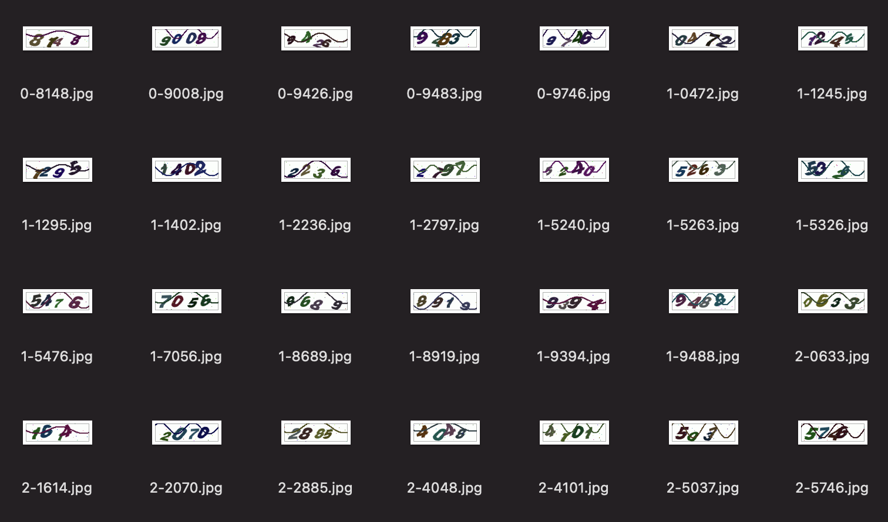

# 深度学习实战项目

## 手写数字识别

## 图片分类
  
参考：https://pytorch123.com/SecondSection/training_a_classifier/

## 验证码识别

### 效果图



### 运行

1. 进入到captcha子项目（注意目录层级关系）

    ```shell
    cd captcha
    mkdir -p data/train
    mkdir -p data/test
    mkdir -p data/predict
    ```

2. 从验证码接口获取验证码图片，并手动打标签，运行gen.py（我手动打了1000张图片的标签）

    ```python
    python gen.py
    ```

3. 训练模型和测试模型

    ```python
    python train.py
    ```
  
    运行结果为：正确率为90%以上

4. 预测（可供外部应用使用）

    ```python
    python predict.py
    ```


## 神经网络

Dense: 全连接层。

CNN2D:2维卷积神经网络，常用于处理图像。

Dropout: 以一定概率放弃两层之间的一些神经元链接，防止过拟合，可以加在网络层与层之间。

optimizer: 优化器，梯度下降的优化方法